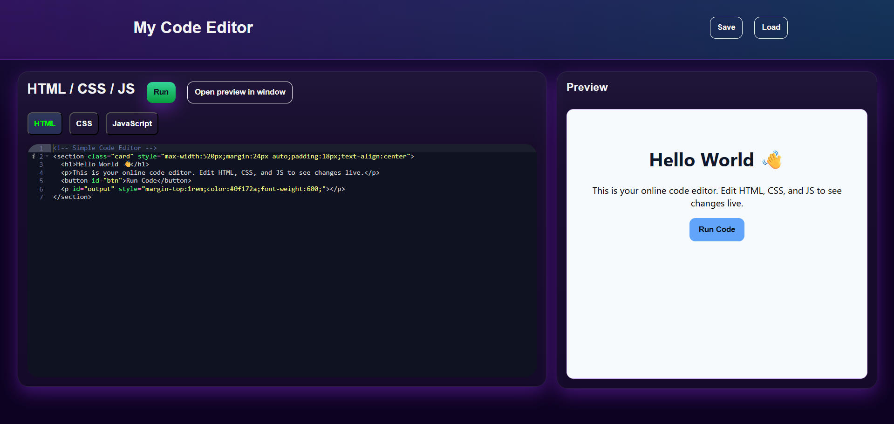

# My Code Editor 💻

A browser-based **HTML, CSS, and JavaScript code editor** built with [Ace Editor](https://ace.c9.io/).  
It lets you write code in separate tabs, run it instantly in a live preview, and save/load your projects locally.

---

## ✨ Features
- 📝 Three editors: **HTML, CSS, JS** with syntax highlighting  
- ⚡ Live preview in an iframe  
- 💾 Save & load projects locally (browser storage + JSON file download)  
- 🎨 Cyberpunk-inspired dark UI theme  
- ⌨️ Keyboard shortcuts:  
  - `Ctrl + Enter` → Run code  
  - `Ctrl + S` → Save project  

---

## 🚀 Demo
🔗 [Live on Vercel](https://my-code-editor-kmexi3997-jesu-2005s-projects.vercel.app/)  



---

## 🛠️ Getting Started

### Clone the repo
```sh
git clone git@github.com:dev-jesu/MyCode-Editor.git
cd MyCode-Editor
